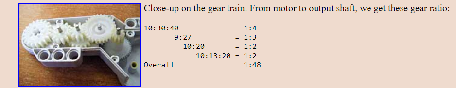
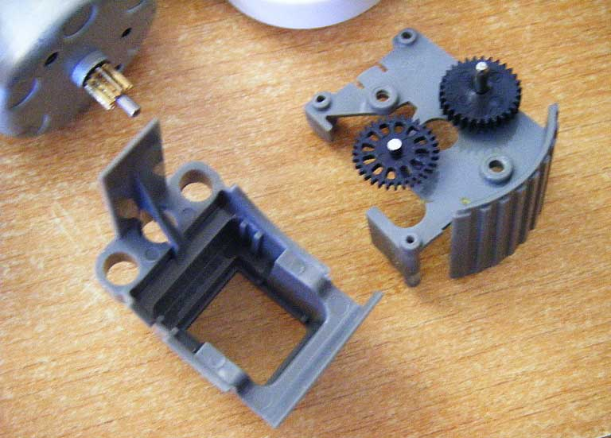
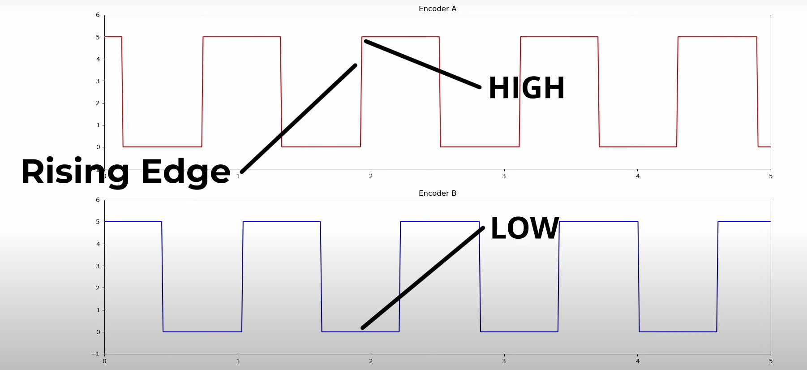

# Motor ev3/nxt

## Caixa de Redução

O motor do nxt e do ev3 possuem uma caixa de redução que transformam 48 voltas do motor em 1 volta da roda.

## Redução do Encoder

O encoder é uma engrenagem de 32 dentes que fica ligada à engrenagem do motor de 10 dentes.
Portanto ha uma redução de 10:32, 32 voltas do encoder são 10 voltas do motor.
Ou seja, 1 volta da roda são 48 voltas do motor que por sua vez significam 15 voltas do encoder.

$$
roda : encoder\ (1:15)\\
\frac{48*10}{32} = 15\\
$$

## Lendo o encoder

O encoder tem uma resolução de 12 gaps. Ou seja, 1 volta da roda são 15 voltas do motor que totalizam $12*15=360$ ticks.
Um tick é uma mudança de negativo para positivo no sinal do encoder. É possivel contabilizar as mudanças de negativo para positivo dando uma resolução de $720$ ticks, mas usar uma resolução dessas no robô seria desnecessário.

O ev3 possui dois encoders nessa roda dentada, assim é possivel distinguir a direção da rotação. Observe no gráfico como o encoder A fica positivo antes do encoder B, isso acontece apensas se o motor está girando no sentido horário, se observarmos o gráfico de tras para frente veremos que o encoder B fica possitivo antes do encoder A, isso ocorre quando o sentido de rotação é o anti-horário.
