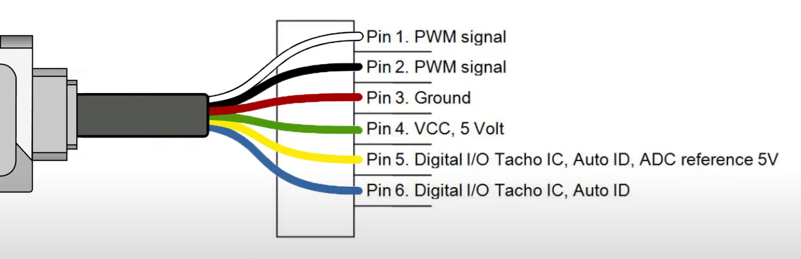

# Encoder.ino

## Motor NXT/EV3


O motor do nxt e do ev3 possuem uma caixa de redução que transformam 48 voltas do motor em 1 volta da roda.

## Redução do Encoder

O encoder é uma engrenagem de 32 dentes que fica ligada à engrenagem do motor de 10 dentes.
Portanto ha uma redução de 10:32, 32 voltas do encoder são 10 voltas do motor.
Ou seja, 1 volta da roda são 48 voltas do motor que por sua vez significam 15 voltas do encoder.

$$
roda : encoder\ (1:15)\\
\frac{48*10}{32} = 15\\
$$

## Lendo o encoder


O encoder tem uma resolução de 12 gaps. Ou seja, 1 volta da roda são 15 voltas do motor que totalizam $12*15=360$ ticks.
Um tick é uma mudança de negativo para positivo no sinal do encoder. É possivel contabilizar as mudanças de negativo para positivo dando uma resolução de $720$ ticks, mas usar uma resolução dessas no robô seria desnecessário.


O ev3 possui dois encoders nessa roda dentada, assim é possivel distinguir a direção da rotação. Observe no gráfico como o encoder A fica positivo antes do encoder B, isso acontece apensas se o motor está girando no sentido horário, se observarmos o gráfico de tras para frente veremos que o encoder B fica possitivo antes do encoder A, isso ocorre quando o sentido de rotação é o anti-horário.

## Programação

### Definindo os pinos



|   COR    | Função          | Ligaçãp           |
| :------: | :-------------- | :---------------- |
|  Branco  | Pino 1 do motor | Ponte H (IN1/IN3) |
|  Preto   | Pino 2 do Motor | Ponte H (IN2/IN4) |
| Vermelho | GND do encoder  | GND do Arduino    |
|  Verde   | VCC do encoder  | 5v do Arduino     |
| Amarelo  | Encoder A       | Digital (2/3)     |
|   Azul   | Encoder B       | Digital (23/53)   |

```C++
// Pins:
//  * Encoder Motor Esquerdo:
#define me_encoder_A 2
#define me_encoder_B 23
//  * Encoder Motor Direito:
#define md_encoder_A 3
#define md_encoder_B 53
```

```C++
// Encoder: motor esquerdo
pinMode(me_encoder_A, INPUT);
pinMode(me_encoder_B, INPUT);
// Encoder: motor direito
pinMode(md_encoder_A, INPUT);
pinMode(md_encoder_B, INPUT);

attachInterrupt(digitalPinToInterrupt(me_encoder_A), contadorEncoderME, RISING);
attachInterrupt(digitalPinToInterrupt(md_encoder_A), contadorEncoderMD, RISING);
```

### Tacômetro

```C++
// Variaveis do Encoder:
long cont_me = 0;
long cont_md = 0;

// ...

void contadorEncoderME() {
    if (digitalRead(me_encoder_B))
        cont_me--;
    else
        cont_me++;
}

void contadorEncoderMD() {
    if (digitalRead(md_encoder_B))
        cont_md--;
    else
        cont_md++;
}
```

Sempre que o encoder de um motor sair de 0v para 5v, a função `contadorEncoder*` associada ao motor será chamada e incrementará o contador da rotação deste motor.
Como explicado antes, esse contador representa a rotação em graus do motor desde o início do programa.
O contador é uma variável do tipo `long int`, isso é, tem um limite entre $-2'147'483'648$ e $2'147'483'647$ que representa pouco menos de 6 milhões de voltas em um único sentido de rotação o que é mais que o suficiente pelas limitações do motor e o tempo máximo da prova (5 min).

### Velocímetro

```C++
void medirVelocidades() {
    ve = (cont_me - prev_cont_me)/delta_tempo;
    vd = (cont_md - prev_cont_md)/delta_tempo;

    #if FILTRER_ON
        // Filtra a leitura da velocidade.
        ve = (1 - ALPHA) * ve + ALPHA * prev_ve;
        vd = (1 - ALPHA) * vd + ALPHA * prev_vd;
        prev_ve = ve;
        prev_vd = vd;
    #endif
    // Manutenção das variáveis:
    prev_cont_me = cont_me;
    prev_cont_md = cont_md;
}
```

Simplesmente calcula a velocidade média do robô no intervalo `delta_tempo` (tempo em segundos de um ciclo do `loop`).

$\vec{v}_e=\frac{\Delta cont\_me}{\Delta t};$

$\vec{v}_d=\frac{\Delta cont\_md}{\Delta t};$

O filtro é um simples low pass filter onde `ALPHA = 0.1`. Serve para estabilizar o termo derivativo do PID, já que sem o filtro a variação que é medida nesse termo é drasticamente influenciada pelo ruído das medidas.
