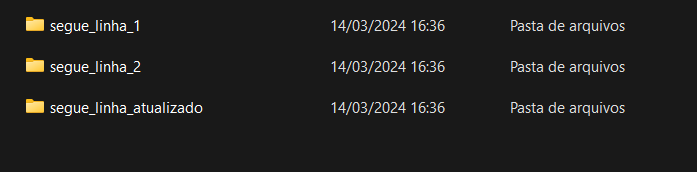
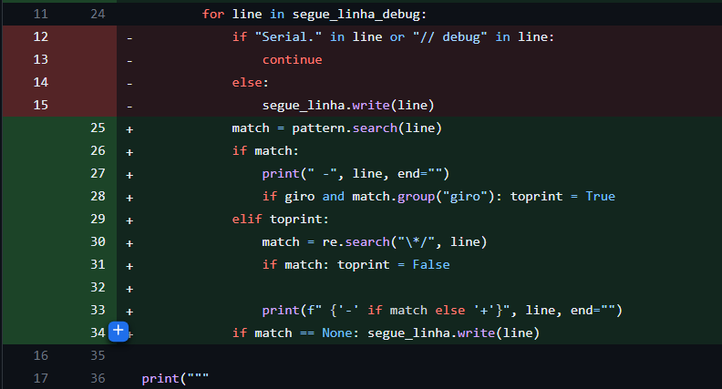
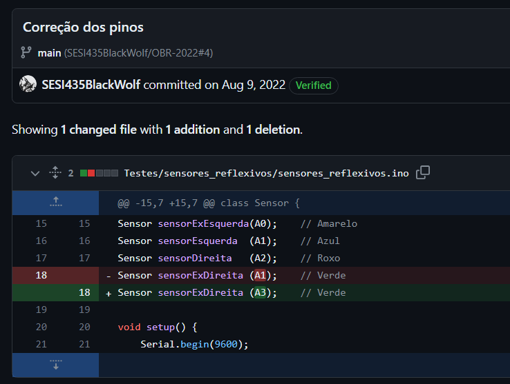
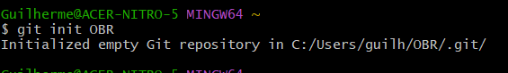
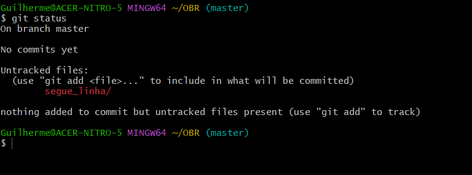
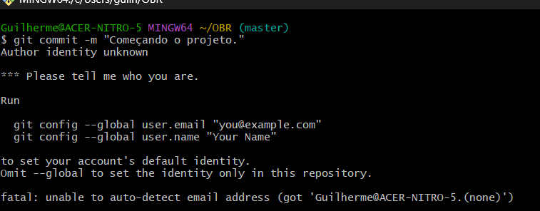

# Git para OBR

## O que é o Git

Git é uma ferramenta de linha de comando (terminal) para organizar as versões do seu código.
Por exemplo, ao invés de duplicarmos os arduivos:



O que é estramemente ineficiente, além de precisar ser feito manualmente está sujeita a muitos erros humanos.

Git pode parecer difícil de começar a usar, mas decorando 7 comandos é possivel tirar 100% do proveito do git nos seus projetos.

## Como Git funciona

O Git é um programa que procura pelos arquivos dentro do diretório do seu projeto e detecta quando ele é modificado. Usando os comandos do git ele salva um 'patch' que é um arquivo que descrve as modificações do arquivo, um patch se parece com isso:



As linhas que começam com um `-` representa uma linha excluida e as linhas que começam com `+` representam linhas adicionadas. Uma linha que seja modificada apareceria como excluida e sua modificação adicionada. Por exemplo, corrigimos o texto `2 + 2 = 5`.

```patch
- 2 + 2 = 5
+ 2 + 2 = 4
```

Apenas esse patch é salvo pelo git e não uma cópia inteira do arquivo, assim aproveitando melhor a memória.
Esse patch é salvo em um ´commit´, commits são um conjunto de modificações, commits carregam um patch e uma mensagem que descreve a modificação, por exemplo:



A mensagem do commit é `Correção dos pinos` e o patch é:

```patch
- Sensor sensorExDireita (A1);
+ Sensor sensorExDireita (A3);
```

Commits são organizados onde um commit antigo aponta para um mais novo assim o git pode seguir os commits e recriar os arquivos do projeto, permitindo baixar ou atulizar um projeto rapidamente.

## Instalando Git:

Vá no google e pesquise por git, e procure pela página de downloads para windows, clique em `64-bit Git for Windows Setup`. Esse instalador irá instalar o git e um terminal para usarmos com as ferramentas do linux.

## Utilizando Git

Para começar abra o `Git Bash`, ele automáticamente abrirá na sua pasta de usuário, para verificar digite `whoami` no terminal e aperte enter, esse comando deverá mostrar o seu nome de usuário do windows.

Nota, para copiar e colar textos dentro do terminal clique com o botão direito do mouse, não só mostrará os comandos de copiar e colar como também os comandos do teclado. Não é ctrl+C, ctrl+V.

Primeiro, vamos cirar um diretório para o projeto, esse diretório é apenas uma pasta contendo uma pasta oculta `.git` dentro. Esse diretório é chamado de repositório. Para isso vamos usar o comando: `git init <nome do diretório>`.



Para movermos para dentro do repositório usamos o comando `cd` para change directory, basta digitar `cd OBR` e apertar enter.
Note que o git bash mostrará `~/OBR (master)`, o caracter '~' é um atalho para a sua pasta de usuário `C:\Users\<nome>` e `(master)` é o branch principal.

Vamos cirar uma scketch de arduino usando o git bash para você se acostumar com o terminal. Execute no terminal os seguintes comandos:

```bash
mkdir segue_linha
cd segue_linha
touch segue_linha.ino
cd ..
```

A IDE do arduino exige que o código esteja dentro de uma pasta com o mesmo nome para isso usamos `mkdir` de make directory para criar essa pasta, entramos na pasta com `cd`, usamos o comando `touch` para cirar um novo arquivo e por fim usamos `cd ..` para voltar para o diretório anterior `OBR`.

Ao usar um terminal precisamos decorar ao menos esses dois comandos:

```bash
cd    # muda dediretório
mkdir # cria um novo diretório
```

E os seguintes simbolos:

```bash
~  # representa a pasta do usuário conhecida como HOME.
.  # representa o diretório atual
.. # representa o diretório superior, ou anterior
```

Agora vamos aprender um pouco do git do dia a dia:
Criamos um novo arquivo, então o git ja deve tê-lo detectado.
Vamos usar o comando `git status` para visualizar os arquivos criados e modificados.



Oberve que a basta segue_linha aparece com cor vermelha e a mensagem abaixo diz que existem arquivos `untracked` não rastreados, arquivos serão adicionados ao git mesmo vazios, mas apenas se forem rastreados, isso permite ter arquivos não registrados no git dentro do seu repositório, voltaremos a esse tópico mais para frente.
Vamos fazer nosso primeiro commit, para isso precisamos adicionar os arquivos que vamos commit ao stage (pode ser traduzido como estacionamento), arquivos em stage terão suas modificações adicionadas ao commit a aparecerão como verdes ao executar `git status`.

Para adicionar nossos arquivos ao stage usaos o comando `git add`.
Execute:

```bash
git add segue_linha/segue_linha.ino
git status
```

Oberseve como a pasta aparece como verde, significa que arquivos estão em stage, no caso o arquivo `segue_linha.ino`. Caso desejamos comitar muitos arquivos podemos aproveitar as funcionalidades do terminal.

```bash
# adiciona todos os arquivos modificados
git add .
# adiciona todos os arquivos modificados dentro do diretório passado como parâmetro
git add <diretório>
# adiciona todos os arquivos do tipo teste_<alguma coisa>.ino ex: ´teste_1.ino´
git add teste_*.ino 
```

Finalmente vamos fazer um commit, ou não. Use o comando `git commit -m "<mensagem>"` para fazer um commit com uma mensagem especificada entre `" "`.

```bash
git commit -m "Comaçando o projeto."
```



O git exige que você registre um nome e um email para registrar o autor do commit, basta seguirmos as instruções que o git nos dá:

```bash
git config --global user.email "<seu email>"
git config --global user.name "<seu nome>"
```

Esses comandos criarão um arquivo `.gitconfig` dentro da sua pasta de usuário. Para vê-lo basta digitar o comando `notepad ~/.gitconfig`.

Agora podemos fazer nosso commit, execute:

```bash
git commit -m "Comaçando o projeto."
```

Para visualizar nosso commits use o comando `git log`.

Pronto, esse é o básico do git, como adicionar modificações e comita-las. Basta seguir a sequência `git add`, `git commit -m "mensagem"`.

## Usando branchs:

Para começar a usar branchs precisamos criar uma, atualmente temos uma branch a `master`, vamos listar nossas branchs usando o comando:

```bash
git branch
```

Vamos cirar uma nova branch usando o comando:

```bash
git branch teste
```

E vamos trocar de branch usando:

```bash
git switch seguelinha 
```

É possivel usar o comando switch para criar e ja trocar de branch usando a tag `-c` de create:

```bash
git switch -c seguelinha
```

Oberve como não aparece mais `(master)` e sim `(teste)`.
Agora podemos fazer uma modificação e comitar. Abra o arquivo `segue_linha.ino` com a IDE do arduino e adicione:

```c
void setup() {
    // setup
}

void loop() {
    // loop
}
```

Agora volte ao terminal e comite as modificações:

```bash
git add .
git commit -m "Começando a programação do segue_linha."
```

O que fazemos se quisermos adicionar as modificações de um branch ao branch principal `master`.
Vamos voltar para o branch principal com `git switch master` e vamos realizar um merge. O comando merge copia os commits de um branch para o branch local:

```bash
git merge seguelinha
```

Agora podemos excluir nosso branch depois de mergeado usando `git branch` e a tag `-D` para delete.

```bash
git branch -D seguelinha
```

Existem muito mais coisas a se falar sobre branchs, mas como quero apenas introduzir git para vocês então vamos para por aqui.
Em resumo seguimos o procedimento:

```bash
git switch -c <nome_branch> # criamos um novo branch
...
git add
git commit -m 
# fazemos nossos commits
...
git switch master
git merge <nome_branch>
```

## Usando Git e GitHub

Muitas vezes queremos compartilhar nosso repositório com outros programadores para que eles contribuam com o código, por isso usamos o github.
Pegando como exemplo o repositório ja criado da robótica vamos ao terminal do git bash e digitamos o seguinte comando:

```bash
git clone https://github.com/Black-Wolf-SESI-435/OBR_2024.git
```

Iso funciona como um git init, mas ao invés de começar um repositório novo ele clona um repositório ja existente, esse repositório que clonamos é chamado repositório local, enquanto o github é o repositório remóto. Podemos trabalhar no nosso repositório local normalmente como exemplificado nos tópicos anteriores e quanto terminarmos uma certa funcionalidade usamos o comando:

```bash
git push
```

Esse comando empurra as modificações (commits) para o repositório remoto, talvez seja necessário logar na conta da OBR para isso.

Sendo o programador do outro lado, vendo que uma modificações foi lançada no github é preciso atualizar o seu repositório local para receber as modifações feitas pelos outros programadores. Para isso usamos o commando:

```bash
git pull
```

Esse comando puxa as modificações para atualizar nosso repositório local.

## Considerações Finais

Esse é o básico do git, decorar os comandos:

```bash
git status
git add
git commit
git bransh
git merge
git push
git pull
```

Vai permitir que você comece a contriuir em repositórios e a utilizar o github. Ainda existem coisas a aprender como, resolvendo problemas de merging, usando chaves ssh, coisas como o nome da branch principal e como fazer pull requests. Mas, para a robótica ja é mais que o suficiente. Vocês podem procurar tutorias para complementar esse documento, principalmente na parte de erros de merging.