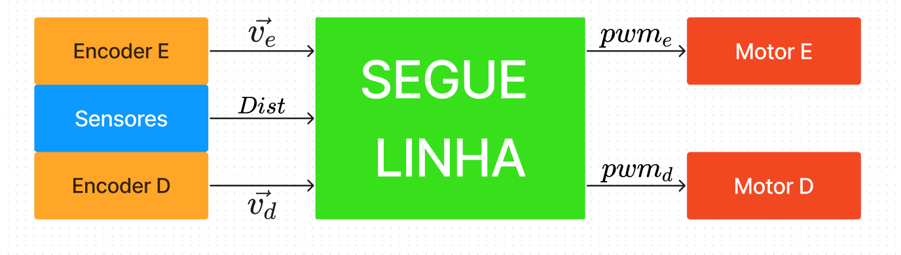
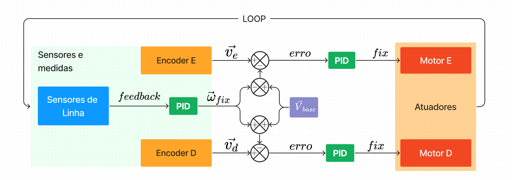

# Segue Linha.ino

## Diagrama do Algorítmo

O algorítmo do segue linha em sí é bem simples.
Os sensores reflexivos fazem a leitura e retornam um `feedback`.
Esse número é entregue ao `pid_linha` que retorna uma correção considerada como uma velocidade angular.
Essa velociade angular altera a velocidade linear do motor esquerdo e do motor direito.
Um PID é atrelado a cada motor para controlar a velocidade, `pid_motor_esquerdo` e `pid_motor_direito`, cada um dos PIDS retorna um valor que é passado para o driver da ponte-H.
Dessa forma, os sensores de linha retornam a distância do robô da linha. Os encoders retornam a velocidade instantânea dos motores, esse valores são passados para os PIDs que retornam a voltagem que cada motor deve ter no pwm, efetivamente movendo o robô.

