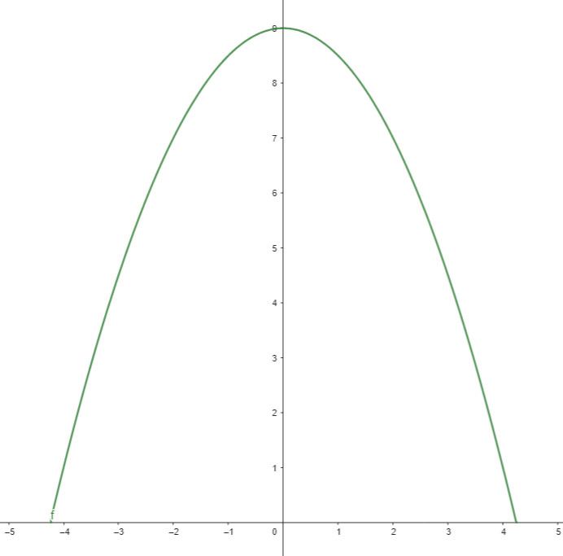
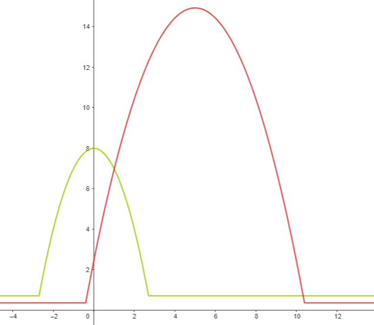
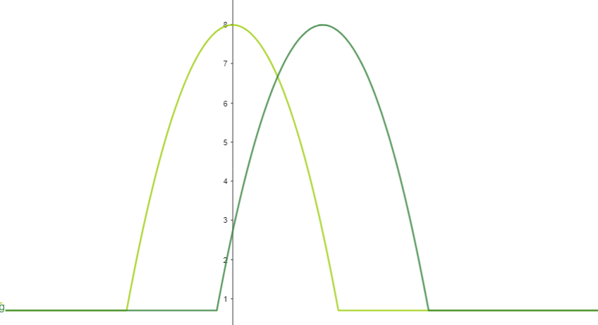
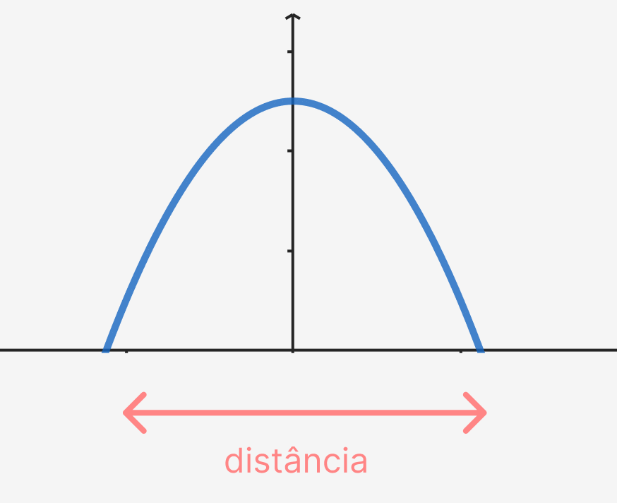
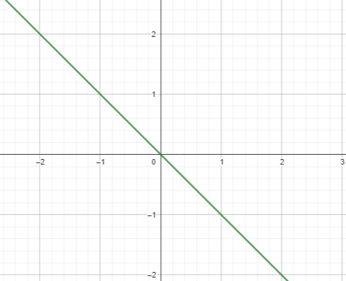
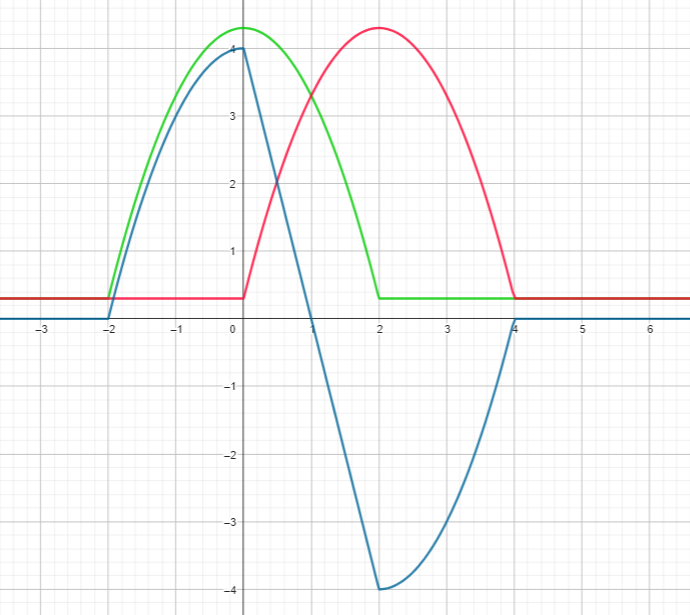

# Sensores.ino

## Escolhendo Sensores

Os sensores de linha emitem luz infravermelha em uma superficie e medem quanta luminosidade é recebida de volta.
A saída do sensor é inversamente proporcional à luminosidade, ou seja, quanto mais luz é refletida menor é a saida e quanto menos maior é a saida.
Por isso, se colocarmos um sensor para passar sobre a fita isolante, a saída resultante teria um curva como esta:



Note como essa curva toca o zero e forma uma paábola, essa é a forma ideal que queremos para a leitura dos nossos sensores após a calibragem.
Uma curva mais realista sobre dois sensores na mesma situação, mas descalibrados pareceria com isso:



Note como tudo é diferente: os máximos, os mínimos e a abertura das parábolas. Para um bom PID, queremos sensores que se aproximem o máximo possível entre seus máximos e mínimos, para ter curvas o mais próximas possivel e assim, com a calibragem, podemos aproveitá-los ao máximo.



## Calibragem

A calibragem é uma simples amostragem dos máximos e mínimos de cada sensor. Assim, ao realizar a leitura, passamos por uma função `map` para trazer do intervalo $[min, max]$ para o intervalo que quisermos.
Idealmente, queremos que a função `map` seja assim:

```C++
int leitura = map(analogRead(sensor_pin), min, max, 0, distancia/2)
```

Onde `distancia` é a distancia entre o ponto em que a leitura sai de 0 até o ponto onde ela retorna ao zero, dada em décimos de milímetros (1 para 0,1 mm). Essa distância é particular de cada sensor, mas quando escohemos sensores com leitura parecida, podemos usar esse valor como constante para todos os sensores. Essa medida não pode ser calculada pelo robô então deve ser feita manualmente por experimentação. É ideal que os sensores sejam espaçados exatamente na metade dessas distâncias, assim a leitura pode ser convertida em uma reta como veremos mais adiante.



## Função Erro

Temos mais de um sensor de linha e precisamos transformar isso em um único número que usaremos como o erro do nosso PID. Isso será feito tornando a leitura dos sensores o mais linear possível, ou seja, uma linha reta.



Para isso iremos usar a seguinte formula:
$leitura = leitura_{esquerda} - leitura_{direita}$
Observe graficamente o como essa equação se comporta:



Em verde e vermelho temos a leitura dos sensores esquerdo e direito, e em azul a leitura final. Observe como entre os máximos dos sensores temos uma curva linear, mesmo nas extremidades apesar de não ser linear, temos valores positivos e negativos que indicam para o PID em qual direção corrigir o erro.

## Filtro Low Pass:

O low pass filter se é bem mais complexo do que eu vou abordar, mas ele aparece multiplas vezes no código e sempre da mesma forma:
A leitura filtrada é 10% da leitura filtrada anterior + 90% da leitura sem filtro atual. Os números 10% e 90% podem mudar, mas como padrão é um bom valor. Eu imagino que laborar mais a descrição desse filtro seja desnecessário.

```C++
// ciclo de leitura:
// ...
int leitura = se_read - sd_read;:
// filtro:
leitura = (1 - ALPHA) * leitura + ALPHA * prev_leitura;
prev_leitura = leitura;
// ...
```
